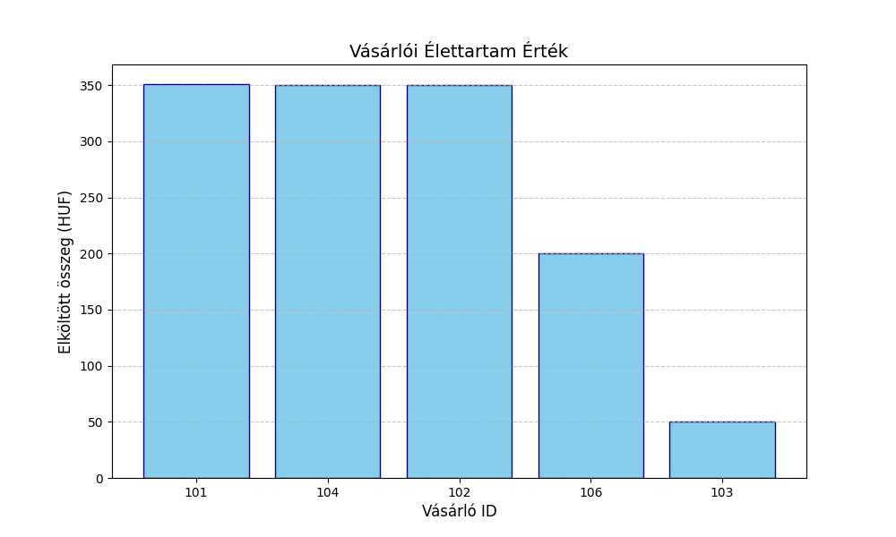

E-commerce Data Pipeline & Analytics (Medallion Architecture)

This project demonstrates an end-to-end data processing pipeline that builds a database from a fictitious webshop's transaction data and generates business decision support reports. The project follows the principles of the modern Data Warehouse Medallion Architecture.

Data architecure:
1. Bronze layer:
Raw data is ingested into the database. In this state, it still contains duplicates and missing values.

2. Silver layer:
This is where the cleansing occurs:
- Removing duplicates: using DISTINCT
- Handling missing values: replacing nulls using COALESCE
- Business filtering: Processing only the succesful transanctions; the script ignores records with a 'cancelled' status

3. Gold Layer:
This layer executes complex SQL queries to create aggregated reports:
- Customer Metrics -> Most valuable customer, order frequency and total amount spent 
- Product Analytics -> Product revenue and popularity

Tech Stack:
- Language: Python
- Database: SQLite
- Libraries: Pandas, SQLAlchemy, Matplotlib

Quick Start:
1. Clone the Repository:
git clone https://github.com/username/project-name

2. Install Dependencies
pip install pandas matplotlib sqlalchemy

3. Execute the main script
python main.py

Project structure:
.
├── bronz_trans.py      # Bronz Layer
├── silver_trans.py     # Silver Layer - Deduplication and data cleansing
├── gold_trans.py       # Gold Layer - Core SQL queries and aggregation
├── main.py             # Main execution and visualization
└── webshop.db          # Database

Visualization:
At the end of the workflow, the script automatically generates a summary chart based on the prepared SQL data, highlighting the company's most valuable customers.

Created by: Molnár Gergő - https://www.linkedin.com/in/gerg%C5%91-moln%C3%A1r-3920b53a7/
